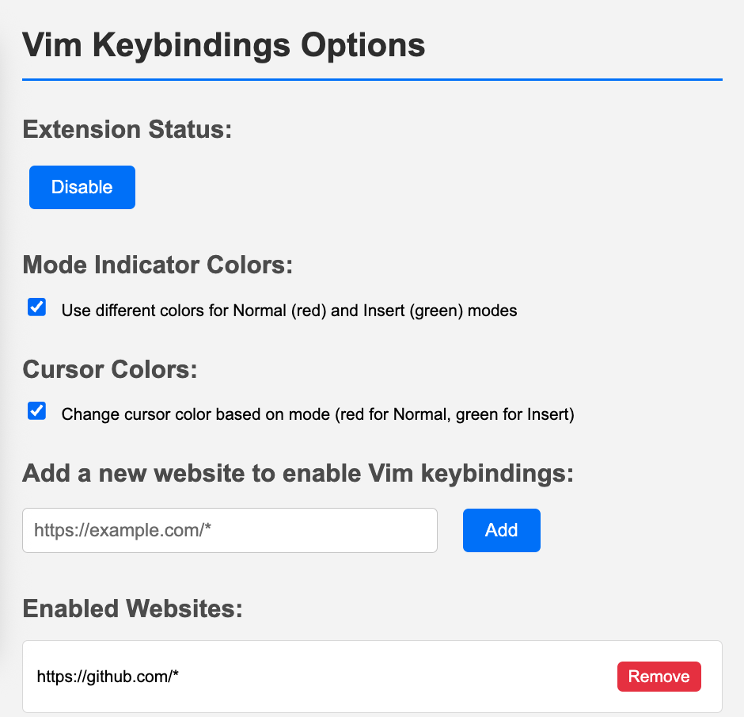

# Bvim

**B**rowser **Vim** - A Chrome extension that brings basic, essential Vim keybindings to text fields on your favorite websites. Navigate and edit text with familiar Vim motions without leaving your browser.

## Features (Current Vim Motions)

**Mode Management:**

- `Esc` - Enter Normal mode from any editable field
- `i` - Enter Insert mode to resume normal typing

**Basic Movement:**

- `h` / `←` - Move cursor left
- `l` / `→` - Move cursor right  
- `j` / `↓` - Move cursor down
- `k` / `↑` - Move cursor up

**Word Movement:**

- `w` - Jump forward to the start of the next word
- `b` - Jump backward to the start of the previous word
- `e` - Jump to the end of the current word

**Editing Commands:**

- `dw` - Delete word (including trailing whitespace)
- `cw` - Change word (delete word without trailing whitespace and enter Insert mode)

**Visual Features:**

- **Mode indicator** - Shows current mode (NORMAL/INSERT/DELETE/CHANGE) in bottom-right corner
- **Cursor color changes** - Red cursor for Normal mode, green cursor for Insert mode (optional)
- **Colored mode indicator** - Red background for Normal mode, green for Insert mode (optional)

**Universal Features:**

- **Arrow key navigation** - Works on ALL websites (even when vim keybindings are disabled)
- **Smart element detection** - Automatically works with textareas, input fields, and contentEditable elements
- **Site-specific control** - Enable/disable vim keybindings per website
- **FSM-based state management** - Robust finite state machine handles mode transitions and command sequences

**Language Support:**

- **Optimized for English text** - Works best with Latin characters and English content
- **Limited CJK support** - Cursor movement may not work correctly with Chinese, Japanese, or Korean characters

## Configuration

Access the options page to customize your experience:

- **Toggle Extension** - Quickly enable/disable the extension
- **Manage Websites** - Add/remove sites where vim keybindings should be active
- **Mode Indicator Colors** - Choose between colored indicators (red for Normal, green for Insert) or classic black
- **Cursor Colors** - Enable/disable cursor color changes for mode indication

### Default Enabled Sites

- GitHub (`https://github.com/*`)
- ChatGPT (`https://chatgpt.com/*`)
- Google Gemini (`https://gemini.google.com/*`)
- Notion (`https://www.notion.so/*`)

## Planned Features

**Editing Commands:**

- [ ] `x` - Delete character under cursor
- [ ] `r` - Replace single character

**Search & Navigation:**

- [ ] `/` - Search forward
- [ ] `?` - Search backward
- [ ] `n` - Next search result
- [ ] `N` - Previous search result
- [ ] `gg` - Go to first line
- [ ] `G` - Go to last line

## Installation

Since Bvim is not yet published on the Chrome Web Store, you'll need to install it manually as an unpacked extension:

1. **Download the extension**
   - Clone this repository: `git clone https://github.com/hzionn/bvim.git`
   - Or download the ZIP file and extract it to a folder

2. **Open Chrome Extensions page**
   - Navigate to `chrome://extensions/` in your browser
   - Or go to Chrome menu → More tools → Extensions

3. **Enable Developer mode**
   - Toggle the "Developer mode" switch in the top-right corner of the extensions page

4. **Load the extension**
   - Click the "Load unpacked" button that appears
   - Select the `bvim` folder (the root directory containing `manifest.json`)

5. **Verify installation**
   - The Bvim extension should now appear in your extensions list
   - You'll see the extension icon in your browser toolbar

## Usage

1. Navigate to any supported website (or add new sites in options)
2. Click on any text field, textarea, or editable element
3. Press `Esc` to enter Normal mode
4. Use vim keybindings to navigate and edit
5. Press `i` to return to Insert mode for regular typing

The mode indicator in the bottom-right corner shows your current mode and will change colors if you have colored indicators enabled. When typing commands like `dw` or `cw`, the indicator will show DELETE or CHANGE modes respectively.

> ⭐ **If Bvim helps improve your browsing experience, please consider starring this repository!** Your support helps others discover this project and motivates continued development.
